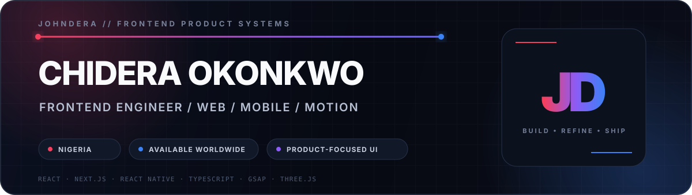

  

  
  
  

  

  I build responsive web, mobile and progressive web products with strong UI engineering,
  practical product thinking and careful attention to performance, accessibility and delivery.

---

## 01 — Selected work

<table>
  <tr>
    <td width="50%" valign="top">
      <h3>Portfolio + CMS</h3>
      
A role-aware publishing platform with authentication, rich-text editing, scheduling, moderation, media uploads, analytics and production-focused quality checks.

      
<strong>React · TypeScript · Firebase · TanStack Query · GSAP · Framer Motion</strong>

      

        <a href="https://johndera-portfolio.vercel.app/">Live portfolio</a>
        ·
        <a href="https://github.com/bos-code/blogger">Source</a>
      

    </td>
    <td width="50%" valign="top">
      <h3>Finance Tracker</h3>
      
A mobile-first finance product with budgeting, savings goals, offline transaction queues, monthly analytics, authentication, PIN protection and biometric locking.

      
<strong>Expo · React Native · TypeScript · Supabase · TanStack Query · Zustand</strong>

      
<a href="https://github.com/bos-code/finance_tracker">Source</a>

    </td>
  </tr>
  <tr>
    <td width="50%" valign="top">
      <h3>StreamVibe</h3>
      
A multi-page streaming discovery experience with TMDB data, persistent watchlists, viewing history, search and filters, detail flows, support and subscription interfaces.

      
<strong>JavaScript · Vite · Sass · Tailwind CSS · GSAP · TMDB API</strong>

      

        <a href="https://stream-vibe-movies.vercel.app/">Live product</a>
        ·
        <a href="https://github.com/bos-code/stream-vibe-movies">Source</a>
      

    </td>
    <td width="50%" valign="top">
      <h3>Starlite Tools</h3>
      
An industrial digital showroom with 193 statically generated product pages, advanced catalogue filtering, product comparison, persistent quote lists and WhatsApp enquiry handoff.

      
<strong>Next.js · React · TypeScript · Tailwind CSS · Static Generation</strong>

      
<a href="https://github.com/bos-code/starlight">Source</a>

    </td>
  </tr>
</table>

---

## 02 — Engineering profile

- Frontend product engineering across responsive web, mobile and PWA experiences.
- Complex dashboards, admin portals, CMS workflows and role-aware product interfaces.
- UI motion and creative development with GSAP, Framer Motion, Three.js and React Three Fiber.
- Data fetching, cache design and application state with TanStack Query, Zustand and Redux.
- Delivery discipline through TypeScript checks, tests, CI, build debugging and Vercel deployment.
- Comfortable translating product and business requirements into clear, usable interfaces.

---

## 03 — Technology stack

<strong>Core frontend and mobile</strong>

  

<strong>Styling, design and motion</strong>

  

<strong>State, data and platform services</strong>

  

<strong>Tooling, quality and delivery</strong>

  

<strong>Currently expanding</strong>

  

  
<strong>Additional experience</strong>

   
  

---

## 04 — GitHub activity

  
  

  

---

## 05 — Contribution trail

  <picture>
    <source media="(prefers-color-scheme: dark)" srcset="https://raw.githubusercontent.com/bos-code/bos-code/output/github-contribution-grid-snake-dark.svg" />
    <source media="(prefers-color-scheme: light), (prefers-color-scheme: no-preference)" srcset="https://raw.githubusercontent.com/bos-code/bos-code/output/github-contribution-grid-snake.svg" />
    
  </picture>

---

  <strong>“Do mighty things.”</strong>
   
  Naruto on a rainy night is still peak vibes.

  

